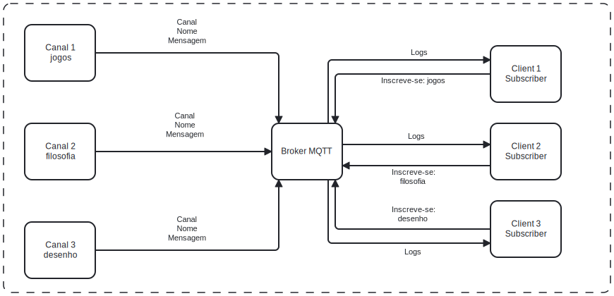

# Sistema de Mensagens em Tempo Real com MQTT e Mosquitto

## Sumário
- [Descrição da Aplicação Desenvolvida](#descrição-da-aplicação-desenvolvida)
- [Justificativa da Escolha do Protocolo](#justificativa-da-escolha-do-protocolo)
- [Diagrama de Arquitetura de Aplicação](#diagrama-de-arquitetura-de-aplicação)
- [Explicação de como os Conceitos de Redes de Computadores Foram Aplicados](#explicação-de-como-os-conceitos-de-redes-de-computadores-foram-aplicados)
- [Instruções para a Execução da Aplicação](#instruções-para-a-execução-da-aplicação)

### Descrição da Aplicação Desenvolvida

A aplicação desenvolvida é um sistema de mensagens em tempo real que permite a comunicação entre múltiplos serviços e um servidor central. Utilizamos o protocolo MQTT com o broker Mosquitto para gerenciar a troca de mensagens. A aplicação é composta por dois componentes principais: um publicador (publisher.js) e um assinante (subscriber.js).

- **Publisher.js**: Este componente permite que os usuários enviem mensagens em tempo real para um canal específico. O usuário escolhe um canal (jogos, filosofia, desenhos), insere seu nome de usuário e começa a enviar mensagens que são publicadas no canal escolhido.
- **Subscriber.js**: Este componente se inscreve em múltiplos canais e recebe mensagens publicadas nesses canais. As mensagens recebidas são exibidas no console, permitindo a comunicação em tempo real entre os usuários.

### Justificativa da Escolha do Protocolo

Optamos por utilizar o protocolo MQTT com o broker Mosquitto devido às seguintes razões:

- **Eficiência**: MQTT é um protocolo leve, ideal para dispositivos com recursos limitados e redes com largura de banda restrita.
- **Baixa Latência**: MQTT oferece baixa latência na entrega de mensagens, o que é crucial para aplicações que requerem comunicação em tempo real.
- **Simplicidade**: A simplicidade do protocolo MQTT facilita a implementação e manutenção da aplicação.
- **Suporte a QoS**: MQTT suporta diferentes níveis de Qualidade de Serviço (QoS), garantindo a entrega das mensagens conforme a necessidade da aplicação.

### Diagrama de Arquitetura de Aplicação


### Explicação de como os Conceitos de Redes de Computadores Foram Aplicados

- **Protocolo de Mensageria**: Utilizamos o protocolo MQTT, que é um protocolo de mensageria leve e eficiente, adequado para comunicação em redes de computadores.
- **Broker**: O Mosquitto atua como um intermediário (broker) que gerencia a distribuição das mensagens entre os publicadores e assinantes.
- **Tópicos**: Utilizamos tópicos para categorizar e organizar as mensagens, permitindo que os assinantes se inscrevam apenas nos tópicos de interesse.
- **Qualidade de Serviço (QoS)**: Embora não explicitamente configurado no código, o MQTT suporta diferentes níveis de QoS para garantir a entrega das mensagens conforme necessário.

### Instruções para a Execução da Aplicação

1. **Instalação das Dependências**:
   - Verifique se você tem o Node.js instalado.
   - Vá até o diretório do projeto e instale as dependências necessárias:
     ```sh
     npm install mqtt readline uuid
     ```

2. **Execução do Broker Mosquitto**:
   - Certifique-se de ter o Mosquitto instalado e em execução. Você pode iniciar o Mosquitto com o comando:
     ```sh
     mosquitto
     ```

3. **Execução do Publisher**:
   - Abra um terminal e execute o publisher.js:
     ```sh
     node publisher.js
     ```

4. **Execução do Subscriber**:
   - Abra outro terminal e execute o subscriber.js:
     ```sh
     node subscriber.js
     ```
